# Manual de Usuario: Simulador de Consumo y Throttling
[Inglés](README.md) | **Español**

## 1. Introducción y Advertencias
Bienvenido al Simulador de Consumo de CUs en Microsoft Fabric. Esta es una herramienta educativa y colaborativa (open source en GitHub) diseñada para entender a nivel detallado las mecánicas de consumo, alisamiento (smoothing) y estrangulamiento (throttling) de la plataforma. 

> [!WARNING]
> Úsese exclusivamente con fines educativos para comprender los conceptos y mecanismos, no para planificaciones de capacidad exactas para producción, ya que los cálculos son aproximados, basados en la documentación disponible públicamente.

## 2. Configuración Inicial: Idioma y Formatos
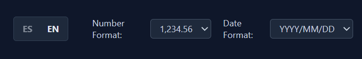

Antes de arrancar la simulación, dirígete a la barra superior. Aquí podrás cambiar el idioma de la interfaz (Inglés o Español) y configurar el formato en el que prefieres visualizar los números y las fechas a lo largo de toda la simulación. 

> [!IMPORTANT]
> Es vital definir estos formatos **antes de iniciar el reloj**, ya que cambiar el idioma o formato en mitad de una simulación provocará un reseteo completo de la misma para asegurar la coherencia de los datos.

## 3. Monitorización de Costes en Tiempo Real
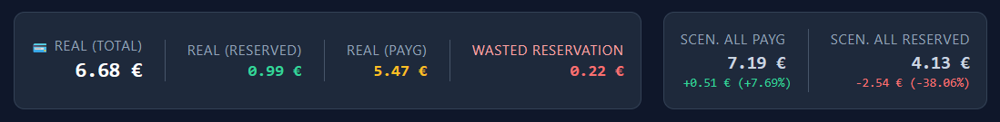

En la esquina superior derecha dispones de un panel financiero en tiempo real. A medida que avance el tiempo, estos contadores acumularán el coste financiero de la simulación. Podrás ver:
- El coste cubierto por tus **Reservas** de capacidad (generalmente más baratas).
- El coste cobrado por uso en **exceso o PAYG** (Pay As You Go).
- Diferentes simulaciones hipotéticas (qué hubiera pasado si todo fuera PAYG o todo Reserva).

## 4. Infraestructura y Reservas
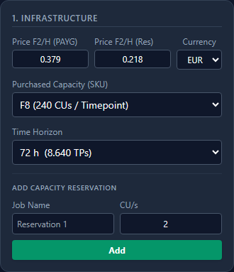

El panel izquierdo **1. Infrastructure** es la base del simulador:
- **Precios (PAYG y Reserva)**: Define cuánto te cuesta una F2 por hora (tanto PAYG como reserva) para poder proyectar la facturación.
- **Capacidad Contratada (SKU)**: Elige el tamaño base de tu capacidad (ej. F8). El simulador multiplicará automáticamente los costes de F2 por el factor necesario.
- **Time Horizon**: Define hasta dónde quieres que llegue el simulador (ej. 72 horas).
- **Añadir Reservas**: Aquí puedes adquirir reservas de CUs. Por ejemplo, en una capacidad F8 podrías tener 2 reservas de 2 CUs cada una, y con eso cubrirías la mitad de las CUs de la misma. Esto reducirá drásticamente tu factura final frente a utilizar 100% PAYG.

## 5. Inyección de Trabajos y Smoothing (Alisamiento)
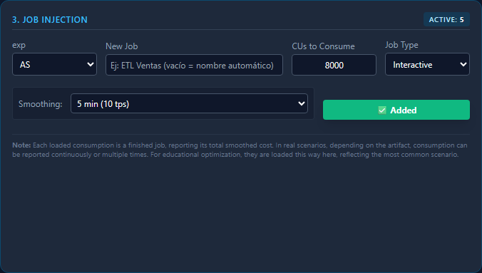

El panel **3. Job Injection** te permite simular la actividad real de la plataforma. Los trabajos en Fabric no consumen todo de golpe, sino que se "alisan" (reparten) a lo largo del tiempo.
1. **Tipo Background (Segundo Plano)**: Los trabajos de fondo, como entrenar un modelo masivo o refrescar un almacén de datos (ETL), se alisan obligatoriamente en **24 horas (2880 Timepoints)**.
2. **Tipo Interactive (Interactivo)**: Las consultas inmediatas, como hacer clic en un dashboard de Power BI, se alisan en ráfagas mucho más cortas. En el simulador puedes escoger un alisamiento que va **desde los 5 minutos hasta los 64 minutos** dependiendo del tipo de carga (tal como lo establece la documentación de Microsoft respecto al alisado).

Es importante destacar que aquí cargaremos lo que serían trabajos finalizados, de los cuales ya sabemos cuál es su precio y en cuántos TP se alisan. En Fabric, los trabajos que están en curso también pueden ir reportando consumos, y se va actualizando el total de CUs al finalizar el trabajo, pero a efectos de esta simulación se entiende que estamos cargando trabajos finalizados y con su costo en CUs definido.

Los trabajos se pueden ver en el panel de trabajos justo debajo del gráfico de la simulación, los trabajos que se mostrarán son los del timepoint seleccionado.

Podemos crear nuevos trabajos con la simulación corriendo o detenida.

Si cargamos trabajos antes de iniciar la simulación, los veremos en el panel de trabajos, que está justo debajo de la gráfica. Una vez que se inicie la simulación, los trabajos que se mostrarán son los del TP Seleccionado.

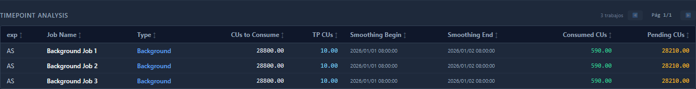

## 6. Control del Reloj y Velocidad
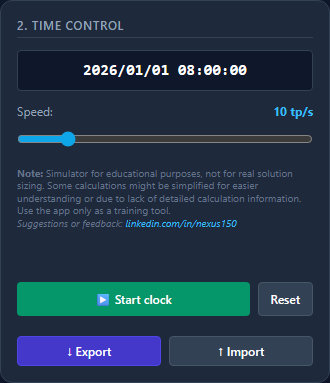

El panel **2. Time Control** es el motor de la simulación.
- **Deslizador Speed**: Permite acelerar el paso del tiempo. Puedes avanzar desde 1 Timepoint por segundo (lento y detallado) hasta 60 Timepoints por segundo para observar la evolución a vista de pájaro.
- Usa los botones "Start Clock" / "Pause Clock" para arrancar y detener el avance de la gráfica.
- Puedes detener la gráfica cuando lo desees para analizar un timepoint o toda la simulación con tranquilidad.

## 7. La Gráfica y Navegación
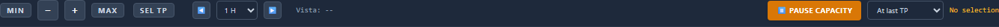
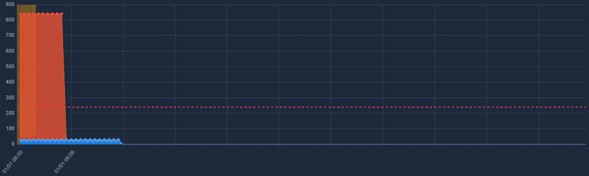
El lienzo central muestra la batalla constante entre tus trabajos y tu capacidad:
- **Línea Roja Punteada**: Es tu capacidad contratada máxima.
- **Capa Azul**: Trabajos de Background.
- **Capa Roja**: Trabajos Interactivos.
Si el apilamiento de trabajos supera la línea roja, entra en juego el **Overage Bucket**. La plataforma de Fabric no rechaza los trabajos inmediatamente, sino que acumula ese exceso como "deuda". Cuando el consumo caiga por debajo de la línea roja, ese margen sobrante se utilizará para "quemar" y pagar la deuda acumulada.

Para seleccionar un timepoint simplemente haz clic en el mismo en la gráfica, a cualquier altura; con ello se mostrará el listado de trabajos activos en ese TP y también los paneles de análisis de timepoint detallados. (Ten en cuenta que trabajos activos son aquellos por los cuales se está pagando consumo en ese TP, no los trabajos en ejecución, que están fuera del ámbito de este simulador).

Puedes interactuar con los botones que se encuentran encima de la gráfica:
- **Min / Max**: Ver toda la simulación o hacer zoom sobre el punto de actualidad.
- **Sel TP**: Zoom hiper-detallado sobre el Timepoint seleccionado.
- **<- / ->**: Mover el viewport hacia atrás o adelante en el tiempo por horas.
- **Live View**: Restaurar el seguimiento en vivo.
- **Pause Capacity**: El botón rojo de emergencia que detiene el motor de cálculo en el tiempo para inyectar todo el consumo pendiente.

## 8. Auditoría y Análisis de Timepoint (Timepoint Analysis)
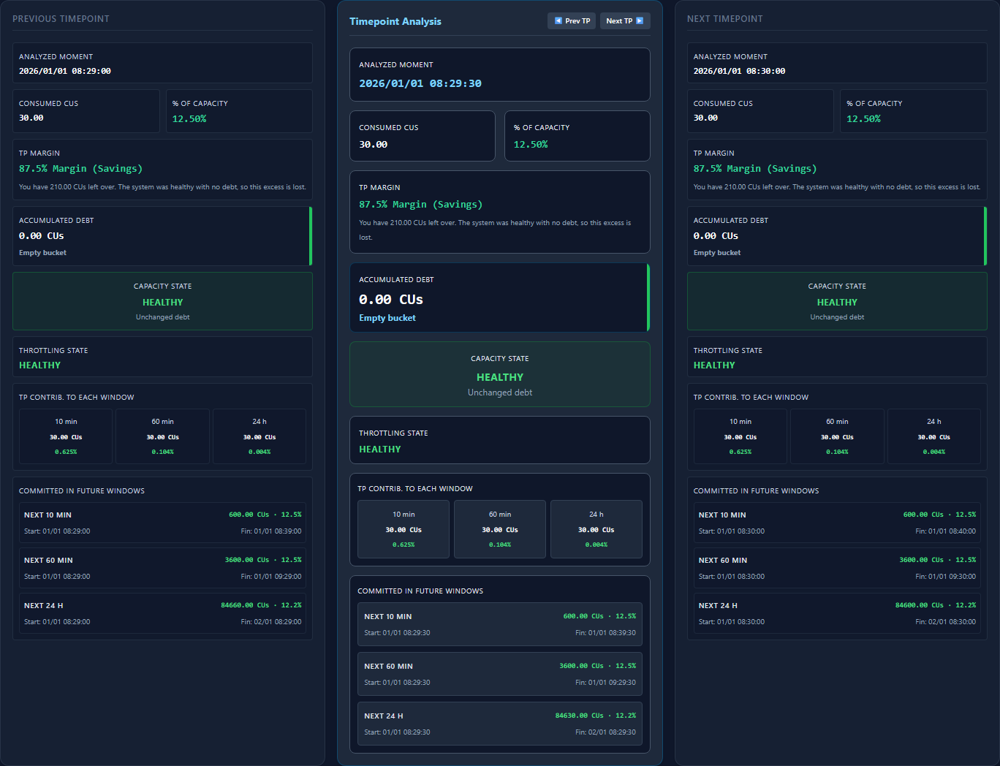
Si haces clic sobre cualquier timepoint de la gráfica, podrás analizar ese Timepoint donde hayas hecho clic.
En la parte inferior de la pantalla aparecerán tres paneles que muestran una auditoría muy detallada:
- El **Timepoint Analysis** detalla qué ocurrió en ese preciso timepoint.
- Te muestra las proyecciones de consumo para los próximos 10 minutos, 60 minutos y 24 horas (vital para calcular el throttling).
- El panel izquierdo (Previous TP) y derecho (Next TP) te permiten comparar el timepoint seleccionado, con el anterior y el siguiente (en caso de haberlos)
- También verás el listado de operaciones activas en ese timepoint.

## 9. Pausar Capacidad: Limpieza de Deuda
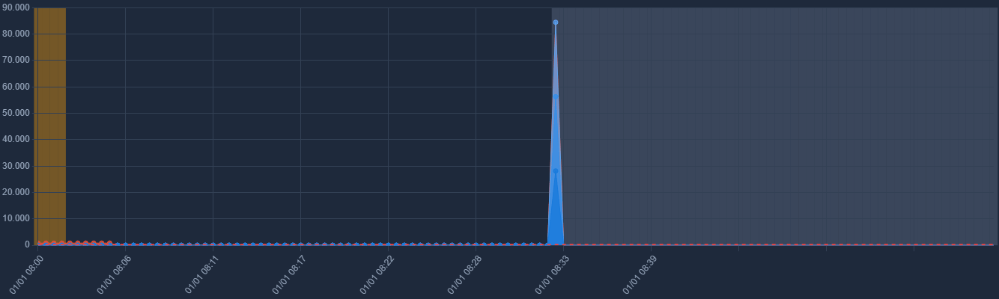
Si decides hacer clic en **Pause Capacity**, el simulador detendrá todos los trabajos. En ese momento ocurre algo destacable en la capacidad Fabric: **cualquier overage acumulado pendiente y todo el consumo alisado que estaba previsto para el futuro se imputa instantáneamente en el presente, justo en el timepoint donde se pausa la capacidad**. Esto genera un pico colosal en el Overage Bucket. Al reanudar la capacidad, el clúster estará libre de deudas.

## 10. Estados de Estrangulamiento (Throttling)
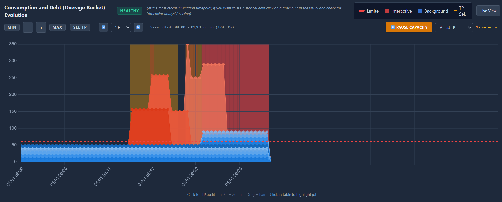
El sistema monitoriza constantemente las predicciones de deuda futura (a 10 min, 60 min y 24 horas). Si dichas predicciones exceden el 100% de la capacidad disponible, la placa de estado cambiará de **Healthy** a colores de alerta:
1. **Interactive Delay (Amarillo)**: Tus operaciones interactivas esperarán 20 segundos antes de comenzar
2. **Interactive Rejection (Naranja)**: Si se supera el consumo de los siguientes 10 minutos, se rechazarán las peticiones interactivas.
3. **Background Rejection (Rojo)**: Al superar las 24 horas de consumo futuro la capacidad rechaza las nuevas operaciones de background (en el caso de este simulador, simplemente no deja cargar más operaciones), en Fabric al llegar a este estado, las operaciones de Background en curso no se detienen, sino que terminan y suman más deuda, sin embargo eso está fuera del objetivo de este simulador. 

## 11. Facturación Horaria (Hourly Billing)
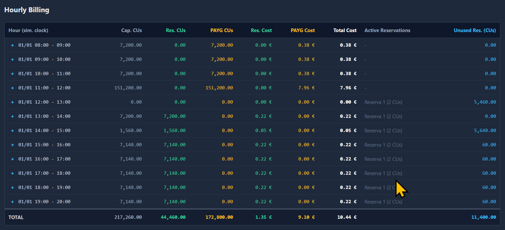
A medida que el reloj cruza el minuto `:00` de cada hora, se genera un registro en la tabla inferior izquierda. Podrás desplegar cada hora (clicando en el icono azul "+") para auditar de forma granular en qué Timepoints precisos se cobró mediante Reserva, y en cuáles se aplicó el sobrecoste (PAYG).

## 12. Registro de Eventos (Event Log)
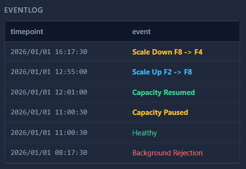
En la parte inferior derecha, el **Event Log** mantiene un trazado cronológico de todos los eventos del sistema. Si el sistema entró y salió de Throttling repetidas veces (debido a la oscilación de la deuda), quedará registrado aquí con su estampa de tiempo exacta.

## 13. Lista de reservas activas(Active Reservations)
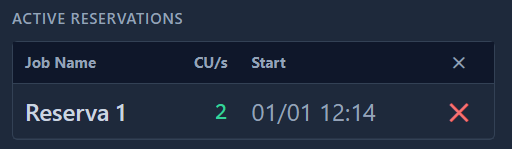

Justo sobre el log de eventos, el panel **Active Reservations** muestra las reservas que tenemos activas en el momento actual, incluyendo la hora en la que se creó. Desde este panel se puede eliminar también una reserva específica si así se desea hacer.

## 14. Exportar e Importar

Si has logrado simular un caso de uso fascinante (o catastrófico), puedes usar el botón **Export** en el panel de control. Esto descargará el estado íntegro de la simulación en formato JSON, pudiendo compartirlo con tus compañeros o cargarlo más tarde usando **Import** para continuar el análisis.

## Resumen de componentes
1. **Configuración Inicial: Idioma y Formatos**.
2. **Monitorización de Costes en Tiempo Real**.
3. **Panel de Infraestrucura (selector de precios y capacidad)**.
4. **Agregar reservas**.
5. **Control del tiempo**.
6. **Iniciar Reloj**.
7. **Reiniciar simulación**.
8. **Exportar simulación**.
9. **Importar simulación**.
10. **Inyección de trabajos**.
11. **Indicador de estado de la capacidad en timepoint actual**.
12. **Volver a la vista en vivo**.
13. **Controles de zoom de la gráfica**.
14. **Pausar capacidad**.
15. **Cuerpo de la gráfica, consumos y Throttling**.
16. **Listado de trabajos activos en el timepoint seleccionado**.

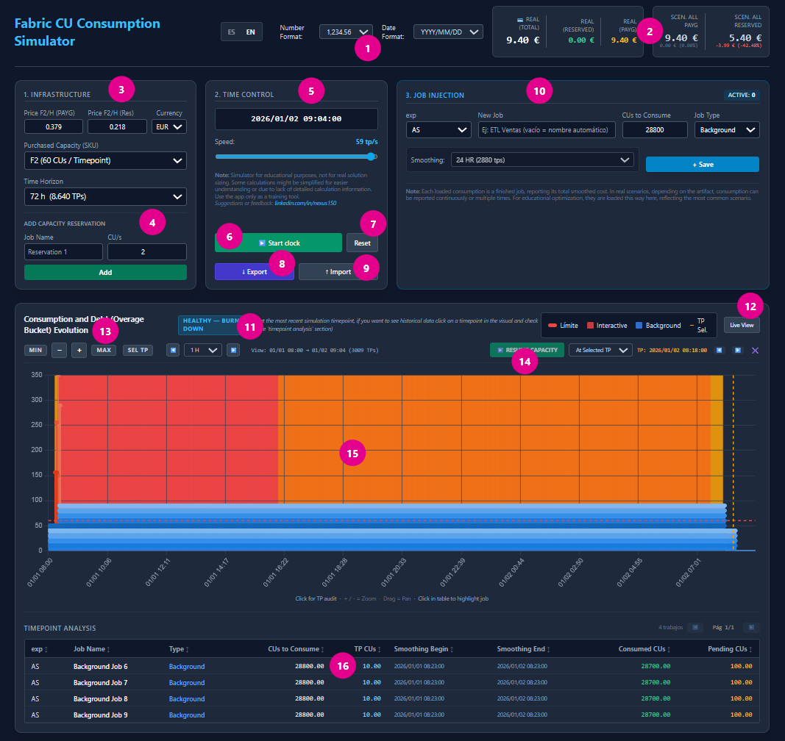

17. **Análisis del timepoint actual**.
18. **Análisis del timepoint anterior**.
19. **Análisis del timepoint siguiente**.
20. **Detalle de facturación por hora y de consumo por timepoint**.
21. **Listado de reservas activas en timepoint actual**.
22. **Log de Eventos**.

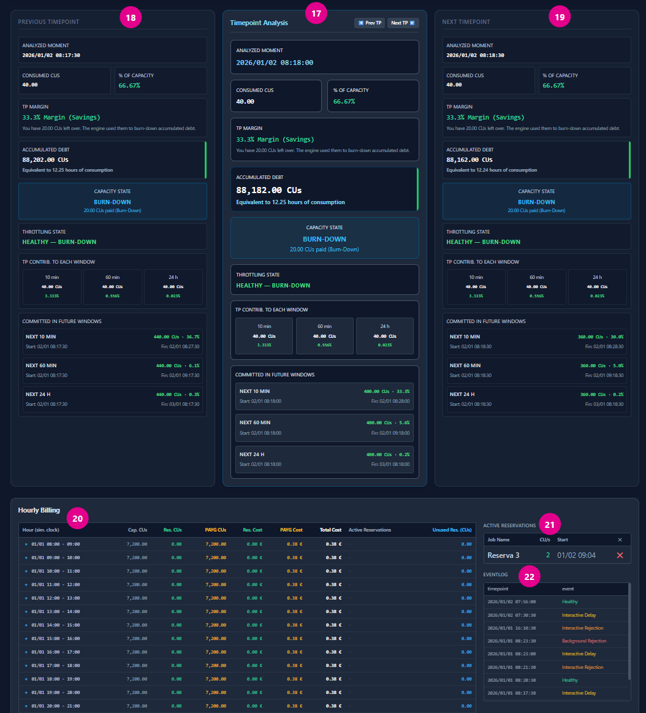